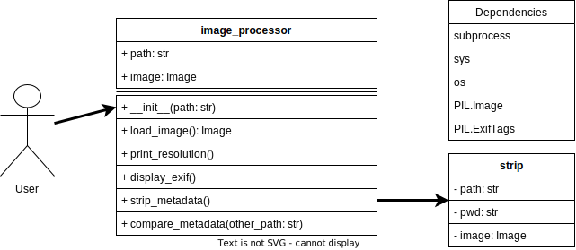

# Image Metadata Processor

This project consists of a set of Python scripts designed to handle image metadata operations, such as viewing, comparing, and stripping metadata from images. The primary components are the `ImageProcessor` and `ImageStripper` classes, which allow users to interact with images through command-line options.

## Features

1. **ImageProcessor** (`image_processor.py`):

   - View image resolution and EXIF metadata.
   - Strip metadata from an image.
   - Compare EXIF metadata between two images.

2. **ImageStripper** (`strip.py`):
   - Strips metadata from an image by saving a new version without metadata.

## Usage

### ImageProcessor (image_processor.py)

Use the following options to perform actions on images:

- **View and Strip Metadata**: `-i`
  ```bash
  python3 image_processor.py <image_path> -i
  ```
- **Check Metadata Only**: `-c`
  ```bash
  python3 image_processor.py <image_path> -c
  ```
- **Compare Metadata Between Images**: `-cmp`
  ```bash
  python3 image_processor.py <image1_path> -cmp <image2_path>
  ```

### ImageStripper `strip.py`

Use `strip.py` independently to strip metadata from an image:

```bash
python3 strip.py <image_path>
```

## Dependencies

This project requires the following dependencies:

- **Python 3.x**
- **Pillow**: Python Imaging Library (PIL) fork, required for image processing.

To install Pillow, use:

```bash
pip install pillow
```

## UML Diagram

The following UML diagram illustrates the structure of the `ImageProcessor` and `ImageStripper` classes:



## Error Handling

- **File Not Found**: Both scripts handle cases where the file does not exist or the path is incorrect.
- **Invalid Image Format**: The scripts will catch errors if the file is not a valid image format (e.g., corrupted file).

## License

This project is licensed under the MIT License.
